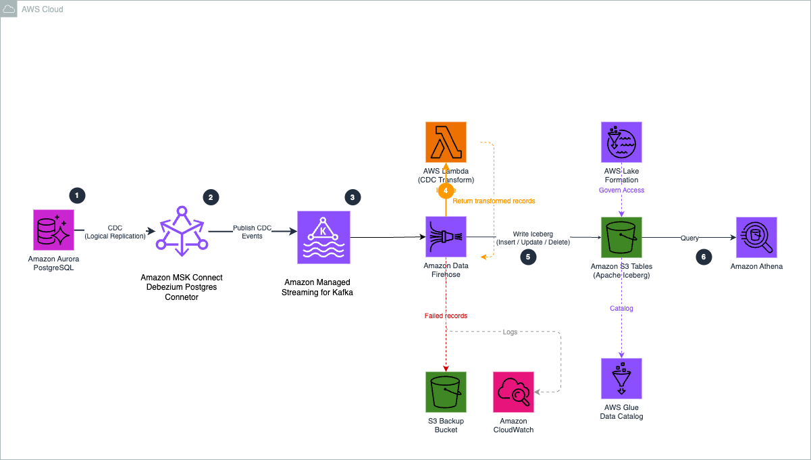

# Real-Time CDC from Amazon Aurora to Amazon S3 Tables

## Overview

Organizations running transactional workloads on Amazon Aurora PostgreSQL often need to make operational data available for analytics without impacting production performance. This becomes especially challenging when data is distributed across multiple Aurora clusters, making it difficult to join datasets and build cross-domain analytics workflows.

Lakehouse architectures built on Apache Iceberg address these challenges by providing a unified data layer with ACID transactions, schema evolution, and time travel capabilities. Amazon S3 Tables provides native support for Apache Iceberg with automatic snapshot management and compaction, making it an ideal foundation for a governed lakehouse architecture.

However, organizations still need a reliable way to continuously ingest operational database changes into the lakehouse while preserving transactional performance.

This solution demonstrates how to build a near real-time change data capture (CDC) pipeline that streams data from Amazon Aurora PostgreSQL into Apache Iceberg tables in Amazon S3 Tables using Debezium, Amazon MSK Connect, AWS Lambda, and Amazon Data Firehose. This architecture enables scalable analytics and lakehouse adoption while keeping transactional workloads isolated from analytics processing.

The architecture uses a single-topic routing pattern: Debezium captures changes from all monitored tables, a Single Message Transform (SMT) routes them to one Kafka topic, and a Lambda function directs each record to the correct Iceberg table. This eliminates the need for multiple Firehose streams and VPC connections, reducing both cost and operational complexity.

### CDC Pipeline



## Architecture

The pipeline consists of six components working together:

1. **Aurora PostgreSQL** — Source database with logical replication enabled. Debezium reads the WAL (Write-Ahead Log) to capture row-level changes without impacting database performance.

2. **Debezium on MSK Connect** — An open-source CDC connector running as a managed MSK Connect worker. It captures changes from two tables (`orders`, `products`) and uses the `ByLogicalTableRouter` SMT to route all events to a single Kafka topic (`aurora.cdc.all-tables`).

3. **Amazon MSK** — Kafka cluster with dual authentication (IAM for Firehose, unauthenticated for Debezium) and VPC connectivity enabled for Firehose PrivateLink access.

4. **AWS Lambda** — Transform function that converts Debezium CDC envelope format to flattened JSON, maps operation types (`c`/`u`/`d`/`r` → `insert`/`update`/`delete`), and sets `otfMetadata` routing to direct each record to the correct destination table.

5. **Amazon Data Firehose** — Delivery stream with MSK as source and Apache Iceberg Tables as destination. Uses private connectivity (PrivateLink) to the MSK cluster and the Lambda function for record transformation and routing.

6. **Amazon S3 Tables** — Managed Apache Iceberg tables organized in a namespace. Supports row-level operations (insert, update, delete) with automatic compaction and snapshot management.

### Key Design Decision: Single Topic Routing

Amazon Data Firehose supports only one MSK topic per delivery stream. Without routing, each table would require its own Firehose stream and VPC connection (~$22/month per AZ). The single-topic pattern with Lambda-based routing uses one Firehose stream for all tables, significantly reducing cost.

## Prerequisites

- An AWS account with permissions to create the resources listed below
- An existing VPC with at least 2 subnets in different Availability Zones
- An Aurora PostgreSQL cluster in the same VPC with logical replication enabled (`rds.logical_replication = 1`)
- AWS CDK v2 installed (`npm install -g aws-cdk`)
- Node.js 18+ and npm
- AWS CLI v2 configured with appropriate credentials

### Aurora PostgreSQL Setup

Before deploying the pipeline, configure your Aurora database for CDC:

```sql
-- Create the tables
CREATE TABLE public.orders (
    order_id SERIAL PRIMARY KEY,
    customer_id INTEGER,
    order_date VARCHAR(50),
    total_amount DECIMAL(12,2),
    status VARCHAR(50),
    created_at TIMESTAMP DEFAULT NOW(),
    updated_at TIMESTAMP DEFAULT NOW()
);

CREATE TABLE public.products (
    product_id SERIAL PRIMARY KEY,
    product_name VARCHAR(255),
    category VARCHAR(100),
    price DECIMAL(10,2),
    stock_quantity INTEGER,
    created_at TIMESTAMP DEFAULT NOW(),
    updated_at TIMESTAMP DEFAULT NOW()
);

-- Create replication slot and publication for Debezium
SELECT pg_create_logical_replication_slot('debezium_slot', 'pgoutput');
CREATE PUBLICATION dbz_publication FOR TABLE public.orders, public.products;
```

## Deployment

### Step 1: Configure

Update `cdk/lib/v2/config.ts` with your environment values:

```typescript
export const CONFIG = {
  account: '<your-account-id>',
  region: '<your-region>',

  // VPC — must match your Aurora cluster's VPC
  vpcId: '<your-vpc-id>',
  subnetIds: ['<subnet-1>', '<subnet-2>'],
  auroraSecurityGroupId: '<aurora-security-group-id>',

  // Aurora
  auroraEndpoint: '<aurora-cluster-endpoint>',
  auroraPort: '5432',
  auroraDbName: '<database-name>',
  auroraUser: '<db-user>',
  auroraSecretArn: '<secrets-manager-arn>',

  // MSK
  mskClusterName: 'aurora-cdc-cluster',
  mskKafkaVersion: '3.7.x',
  mskInstanceType: 'kafka.m5.large',
  mskBrokerCount: 2,
  mskEbsVolumeSize: 100,

  // S3 Tables
  s3TablesBucketName: '<your-table-bucket-name>',
  s3TablesNamespace: 'aurora_cdc',
  tables: ['orders', 'products'],
  tableKeys: { orders: 'order_id', products: 'product_id' },

  // Firehose
  firehoseBackupBucket: '<your-backup-bucket-name>',

  // Debezium — update after Step 2
  debeziumPluginArn: '',
  debeziumWorkerConfigArn: '',
  debeziumPluginBucket: '<your-plugin-bucket-name>',
  debeziumTopicPrefix: 'aurora.cdc',
  debeziumTables: 'public.orders,public.products',
};
```

### Step 2: Build and register the Debezium plugin

MSK Connect requires a custom plugin ZIP containing the Debezium connector JARs. Build and upload it:

```bash
# Download Debezium PostgreSQL connector
DEBEZIUM_VERSION=2.7.3.Final
curl -LO "https://repo1.maven.org/maven2/io/debezium/debezium-connector-postgres/${DEBEZIUM_VERSION}/debezium-connector-postgres-${DEBEZIUM_VERSION}-plugin.tar.gz"

# Package as ZIP
mkdir -p debezium-plugin
tar -xzf debezium-connector-postgres-${DEBEZIUM_VERSION}-plugin.tar.gz -C debezium-plugin/
cd debezium-plugin && zip -r ../debezium-postgres-connector.zip . && cd ..

# Upload to S3
aws s3 cp debezium-postgres-connector.zip s3://<your-plugin-bucket>/plugins/

# Register as MSK Connect custom plugin
aws kafkaconnect create-custom-plugin \
  --custom-plugin-name debezium-postgres-connector \
  --content-type ZIP \
  --location "s3Location={bucketArn=arn:aws:s3:::<your-plugin-bucket>,fileKey=plugins/debezium-postgres-connector.zip}"

# Create worker configuration
aws kafkaconnect create-worker-configuration \
  --name debezium-worker-config \
  --properties-file-content "$(echo -n 'key.converter=org.apache.kafka.connect.json.JsonConverter
value.converter=org.apache.kafka.connect.json.JsonConverter
key.converter.schemas.enable=false
value.converter.schemas.enable=false' | base64)"
```

Update `config.ts` with the returned `debeziumPluginArn` and `debeziumWorkerConfigArn`.

### Step 3: Deploy CDK stacks

```bash
cd cdk
npm install

# Deploy all stacks
npx cdk --app "npx ts-node bin/app-v2.ts" deploy --all
```

This deploys 8 stacks in dependency order:

| Stack | Resources |
|-------|-----------|
| `CdcMskCluster` | MSK cluster with IAM auth, VPC connectivity, auto.create.topics config, security groups |
| `CdcMskConnectIam` | MSK Connect service role, plugin S3 bucket, connector CloudWatch log group |
| `CdcDebeziumConnector` | Debezium connector with SMT reroute to single topic |
| `CdcS3Tables` | S3 table bucket, namespace, 2 Iceberg tables with schemas |
| `CdcLambdaTransform` | Lambda function for CDC event transformation and routing |
| `CdcFirehoseRole` | Firehose IAM role with MSK, S3 Tables, Glue, Lake Formation, VPC permissions |
| `CdcLakeFormation` | Lake Formation permissions for Firehose role + MSK cluster resource policy |
| `CdcFirehose` | Firehose delivery stream (MSK source → Lambda transform → Iceberg destination) |

> **Note:** The MSK cluster takes ~25 minutes to create. The Debezium connector takes ~5 minutes after the cluster is ready.

## How It Works

### CDC Event Flow

1. A row is inserted/updated/deleted in Aurora PostgreSQL
2. Debezium reads the change from the PostgreSQL WAL via logical replication
3. The `ByLogicalTableRouter` SMT routes the event to `aurora.cdc.all-tables` (regardless of source table)
4. Firehose reads from the topic via PrivateLink and invokes the Lambda transform
5. Lambda extracts the source table name from the Debezium envelope, flattens the record, and sets `otfMetadata` with the destination table and operation type
6. Firehose writes the record to the correct Iceberg table in S3 Tables

### Debezium Event Transformation

The Lambda function converts Debezium's envelope format:

```json
// Debezium CDC event (input)
{
  "op": "c",
  "before": null,
  "after": {"order_id": 1, "customer_id": 1, "total_amount": 299.99},
  "source": {"table": "orders", "db": "cdcdemo", ...}
}
```

Into a flattened record with routing metadata:

```json
// Transformed output with otfMetadata
{
  "data": {"order_id": 1, "customer_id": 1, "total_amount": 299.99},
  "metadata": {
    "otfMetadata": {
      "destinationDatabaseName": "aurora_cdc",
      "destinationTableName": "orders",
      "operation": "insert"
    }
  }
}
```

### Operation Mapping

| Debezium Op | Meaning | Firehose Operation |
|-------------|---------|-------------------|
| `c` | Create (insert) | `insert` |
| `u` | Update | `update` |
| `d` | Delete | `delete` |
| `r` | Snapshot read | `insert` |

For deletes, the Lambda uses the `before` state (the row before deletion) since the `after` field is null.

## Testing

Insert test data into Aurora and verify it appears in S3 Tables:

```sql
-- Insert test records
INSERT INTO public.orders (customer_id, order_date, total_amount, status)
VALUES (1, '2026-01-20', 299.99, 'shipped');

INSERT INTO public.products (product_name, category, price, stock_quantity)
VALUES ('Wireless Headphones', 'Electronics', 79.99, 150);
```

Verify delivery through Firehose (records typically appear within 60–90 seconds):

```bash
# Check Firehose metrics
aws cloudwatch get-metric-statistics \
  --namespace AWS/Firehose \
  --metric-name IncomingRecords \
  --dimensions Name=DeliveryStreamName,Value=msk-to-s3tables-firehose \
  --start-time $(date -u -v-10M +%Y-%m-%dT%H:%M:%S) \
  --end-time $(date -u +%Y-%m-%dT%H:%M:%S) \
  --period 60 --statistics Sum

# Query S3 Tables via Athena (after registering the catalog)
SELECT * FROM "s3tablescatalog/<table-bucket-name>"."aurora_cdc"."orders";
```

## Project Structure

```
├── cdk/
│   ├── bin/app-v2.ts                          # CDK app entry point
│   └── lib/v2/
│       ├── config.ts                          # Shared configuration
│       ├── 1-msk-cluster-stack.ts             # MSK cluster + security groups
│       ├── 2-msk-connect-iam-stack.ts         # MSK Connect IAM role + plugin bucket
│       ├── 2b-debezium-connector-stack.ts     # Debezium connector with SMT reroute
│       ├── 3-s3-tables-stack.ts               # S3 table bucket, namespace, Iceberg tables
│       ├── 4-lambda-transform-stack.ts        # Lambda transform function
│       ├── 5-firehose-role-stack.ts           # Firehose IAM role
│       ├── 6-lakeformation-stack.ts           # Lake Formation permissions + MSK cluster policy
│       └── 7-firehose-stack.ts                # Firehose delivery stream
├── lambda/
│   └── firehose-debezium-transform.py         # CDC event transform + multi-table routing
└── cloudformation/
    ├── build-debezium-plugin.sh               # Build and upload Debezium plugin to S3
    ├── deploy-connector-cli.sh                # CLI-based connector deployment
    └── *.yaml                                 # Reference CloudFormation templates
```

## Cost Considerations

Primary cost drivers for this pipeline (us-east-1 pricing):

| Component | Estimated Monthly Cost | Notes |
|-----------|----------------------|-------|
| MSK Cluster (2× kafka.m5.large) | ~$550 | Largest cost; cannot be paused, only deleted |
| MSK Connect (2 MCU × 2 workers) | ~$90 | Debezium connector workers |
| Firehose VPC Connection | ~$22 | Per-AZ PrivateLink charges |
| Firehose Data Processing | Variable | Based on data volume |
| S3 Tables | Variable | Storage + request costs |
| Lambda | Minimal | Only invoked during Firehose delivery |

> **Tip:** The single-topic routing pattern saves ~$44/month by using one Firehose stream instead of three (one VPC connection vs three).

## Cleanup

Delete resources in reverse dependency order:

```bash
# Delete CDK stacks
cd cdk
npx cdk --app "npx ts-node bin/app-v2.ts" destroy --all

# Delete the Debezium custom plugin and worker configuration (created via CLI)
aws kafkaconnect delete-custom-plugin --custom-plugin-arn <plugin-arn>
aws kafkaconnect delete-worker-configuration --worker-configuration-arn <worker-config-arn>
```

## Security

- MSK uses IAM authentication for Firehose access and private VPC connectivity (no public endpoints)
- Firehose connects to MSK via PrivateLink — traffic stays within the AWS network
- Aurora credentials are stored in AWS Secrets Manager
- All IAM roles follow least-privilege principles
- S3 Tables access is controlled through Lake Formation permissions
- Encryption in transit (TLS) is enabled for MSK inter-broker communication

## License

This library is licensed under the MIT-0 License. See the [LICENSE](LICENSE) file.
